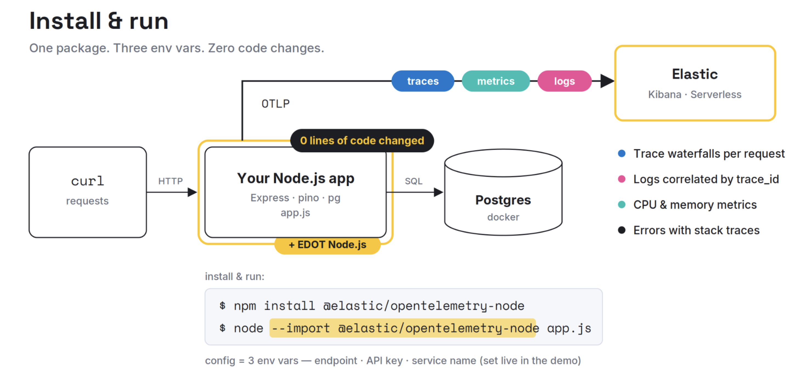

# Observe a Node.js Backend with Elastic using OpenTelemetry (EDOT)

End-to-end runbook: plain Express + Postgres app → full traces, metrics, and logs
in Elastic Serverless — **with zero code changes**, using the
[Elastic Distribution of OpenTelemetry Node.js](https://www.elastic.co/docs/reference/opentelemetry/edot-sdks/node) (EDOT).



## 0. Prerequisites

- **Node.js 20.6+ or 18.19+** 
- **Docker** (only for Postgres — the app itself runs on bare Node)
- **curl** (traffic generation)
- An email address for the free [**Elastic Cloud trial**](https://cloud.elastic.co/registration)

## 1. Create an Elastic Serverless Observability project

1. Go to **https://cloud.elastic.co** and sign up for the free trial.
2. Create a new project → choose the **Serverless** deployment type → project type **Elastic for Observability**. 
3. In your new project, go to **Add data → Application → OpenTelemetry**.
4. On that page, copy the credentials and paste in the project's [.env](.env) file.

## 2. Run the app (uninstrumented first)

Start Postgres (maker sure Docker desktop is running):

```bash
docker run --name storefront-db \
  -e POSTGRES_PASSWORD=postgres \
  -e POSTGRES_DB=storefront \
  -p 5432:5432 -d postgres:16
```

Install and start the app **plain** (no instrumentation yet):

```bash
npm install
npm run start:plain
```

## 3. Instrument with EDOT Node.js that requires zero code changes.

```bash
npm install --save @elastic/opentelemetry-node
```

### Configure the [.env](.env) file or directly paste the commands with your credentials:

```bash
export OTEL_EXPORTER_OTLP_ENDPOINT="<paste the endpoint from Kibana, verbatim>"
export OTEL_EXPORTER_OTLP_HEADERS="Authorization=ApiKey <paste your API key>"
export OTEL_SERVICE_NAME="storefront-api"
```

### Start the app:

```bash
npm start
```

### Generate simulated traffic that will include dummy errors

```bash
npm run load
```

## 5. Switch over to the newly created Observaility project in Elastic serverss and Explore in Kibana:

1. **Service inventory** — *Applications → Service Inventory*. `storefront-api`
   appears with latency, throughput, and failure rate.
2. **Trace waterfall** — click the service → **Transactions** → open `POST /orders`.
   The waterfall shows the Express route, the two `pg.query` spans, and the ~100 ms
   gap of the fake payment call. This is the money shot.
3. **Errors** — the **Errors** tab shows the deliberate `relation "a_table_that_does_not_exist"`
   failures from `/error`, with stack traces and occurrence charts.
4. **Logs ↔ trace correlation** — inside any transaction, use the related **logs**
   view (or *Discover/Logs* filtered by `service.name: storefront-api`). Open a log
   entry: it carries `trace_id`/`span_id`. Jump from a log line to its exact trace and back.
5. **Metrics** — the service **Metrics** tab shows CPU and memory
   (`process.cpu.*`, `process.memory.*` from EDOT's host-metrics defaults).
6. **Dependencies / service map** — shows `storefront-api → postgresql` as a
   downstream dependency with its own latency stats.

## Route map (what each endpoint is *for*)

| Route | Purpose in the demo |
|---|---|
| `GET /products`, `GET /products/:id` | Clean, fast traces; the 404 path emits a correlated `warn` log |
| `POST /orders` | Multi-span waterfall: SELECT → fake payment delay → INSERT |
| `GET /error` | Error traces + correlated `error` logs (Errors tab) |
| `GET /slow` | ~2 s DB sleep — triggers the latency alert |
| `GET /health` | Boring on purpose |

## Useful links

- EDOT Node.js setup docs — https://www.elastic.co/docs/reference/opentelemetry/edot-sdks/node/setup
- Quickstart: monitor application performance — https://www.elastic.co/docs/solutions/observability/get-started/quickstart-monitor-your-application-performance
- Full microservices playground (Astronomy Shop, Elastic fork) — https://github.com/elastic/opentelemetry-demo
- No cloud? Local stack in one command: `curl -fsSL https://elastic.co/start-local | sh -s -- --edot`
