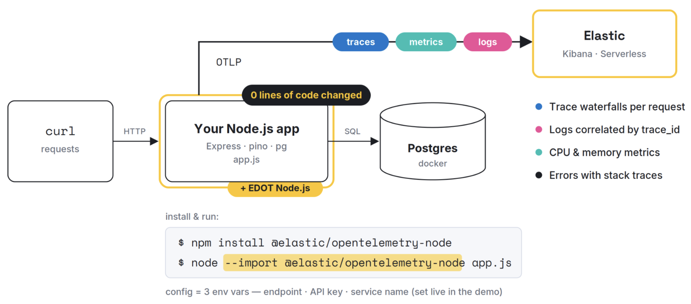

# Observe a Node.js Backend with Elastic using OpenTelemetry (EDOT)

End-to-end runbook: plain Express + Postgres app → full traces, metrics, and logs
in Elastic Serverless — **with zero code changes**, using the
[Elastic Distribution of OpenTelemetry Node.js](https://www.elastic.co/docs/reference/opentelemetry/edot-sdks/node) (EDOT).



## 0. Prerequisites

- **Node.js 20.6+ or 18.19+** 
- **Docker** (only for Postgres — the app itself runs on bare Node)
- **curl** (traffic generation)
- An email address for the free [**Elastic Cloud trial**](https://cloud.elastic.co/registration)

## 1. Create an Elastic Serverless Observability project

1. Go to **https://cloud.elastic.co** and sign up for the free trial.
2. Create a new project → choose the **Serverless** deployment type → project type **Elastic for Observability**. 
3. In your new project, go to **Add data → Application → OpenTelemetry**.
4. On that page, copy the credentials and paste in the project's [.env](.env) file.

## 2. Run the app (uninstrumented first)

Start Postgres (maker sure Docker desktop is running):

```bash
docker run --name storefront-db \
  -e POSTGRES_PASSWORD=postgres \
  -e POSTGRES_DB=storefront \
  -p 5432:5432 -d postgres:16
```

Install and start the app **plain** (no instrumentation yet):

```bash
npm install
npm run start:plain
```

## 3. Instrument with EDOT Node.js that requires zero code changes.

```bash
npm install --save @elastic/opentelemetry-node
```

### Create a .env file or paste the credentials in it:

```bash
touch .env
```
```sh
OTEL_EXPORTER_OTLP_ENDPOINT="<paste the endpoint from Kibana, verbatim>"
OTEL_EXPORTER_OTLP_HEADERS="Authorization=ApiKey <paste your API key>"
OTEL_SERVICE_NAME="storefront-api"
```

### Start the app:

```bash
npm start
```

### Generate simulated traffic that will include dummy errors

```bash
npm run load
```

## 5. Switch over to the newly created Observaility project in Elastic serverss and Explore in Kibana:

1. **Service inventory** — *Applications → Service Inventory*. `storefront-api`

2. **Trace waterfall**
 
3. **Errors** 
   
5. **Logs**
   
7. **Metrics** 
   
9. **Dependencies / service map**

## Additional resources

- EDOT Node.js setup docs: https://www.elastic.co/docs/reference/opentelemetry/edot-sdks/node/setup
- Quickstart: monitor application performance: https://www.elastic.co/docs/solutions/observability/get-started/quickstart-monitor-your-application-performance
- Full microservices playground (Astronomy Shop, Elastic fork): https://github.com/elastic/opentelemetry-demo
